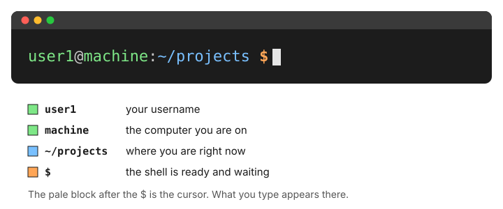
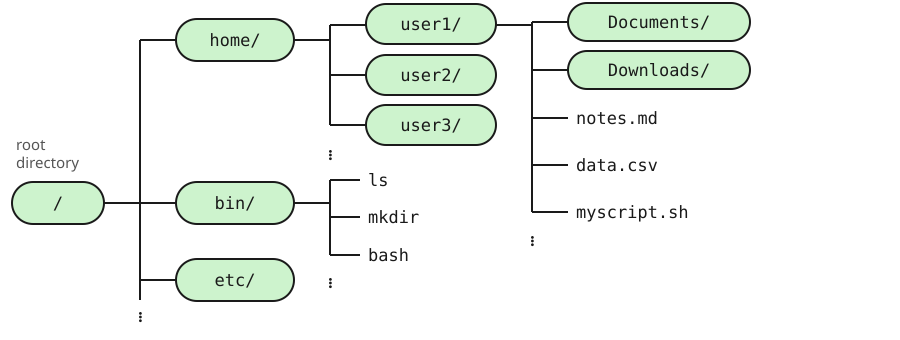
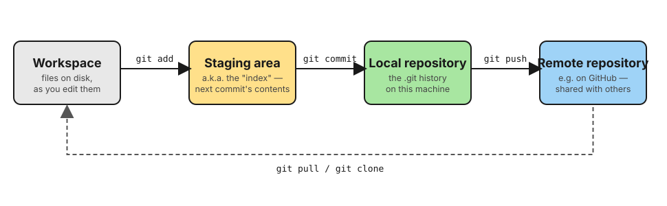

<!--
This deck is written differently from a course lecture deck on purpose, and
the reason belongs here rather than only in a commit message.

A course lecture assumes a narrator: slides are sparse, and the explanation
lives in the person talking. This deck has to survive BOTH being clicked
through alone (no narrator) and being presented live in a future year. So the
slide bodies carry real, complete sentences rather than fragments -- enough to
stand on their own -- while ::: {.notes} carries the extra talking points and
timing cues a live presenter would want. Same file, two audiences.

The written parts remain the source of truth. This deck is a map to them, not
a replacement -- every section ends with a pointer to the part that has the
real depth, the exceptions, and the worked examples.

Executed code blocks here are checked by the same test harness as the parts
themselves (tests/test_examples.py includes this file explicitly). A command
shown on a slide is a command that ran.
-->

## Before you start clicking through {.smaller}

This is a **map**, not the material. Four written parts carry the actual
depth — worked examples, the exceptions, what breaks and why:

- [Part 1 — The command line](parts/01-command-line.qmd)
- [Part 2 — Installing and managing tools](parts/02-packages.qmd)
- [Part 3 — Git and GitHub](parts/03-git.qmd)
- [Part 4 — Files you will meet](parts/04-file-formats.qmd)

**Only Part 1 gates a first practical.** If you are short on time, read that
one properly and treat the rest of this deck as a preview of what is coming.

::: {.notes}
If presenting live: say this out loud before moving on. The deck is
deliberately thin — if a question digs into detail, that is what the
corresponding part is for, not a reason to improvise an answer here.
:::

## Why a terminal at all?

A fair question before spending an evening on this.

- **The tools only exist there.** Most scientific software has no graphical
  interface — and a program that runs from a command line can be run a
  thousand times by another program. One that needs a human to click cannot.
- **It is a record.** A command can be pasted into a methods section, rerun
  next year, and checked by someone else. A sequence of clicks cannot.
- **It scales without changing.** The command that handles one file handles
  four hundred, unmodified.

The cost: nothing is discoverable. A terminal shows a cursor and waits. That
gap is what Part 1 closes.

# Part 1 — The command line

## Reading the prompt

{fig-alt="A terminal prompt: user1 at machine, colon, tilde slash projects, dollar sign, block cursor. A key identifies user1 as the username, machine as the computer, the path as where you are, and the dollar sign as the shell being ready."}

The one part worth watching is **where you currently are** — it changes as you
move, and it answers the question that causes most early confusion.

## The filesystem is one tree

{fig-alt="A tree diagram rooted at a single forward slash, branching into home, bin and etc. home branches into user directories; one user directory branches into Documents, Downloads and files."}

No drive letters. Everything — a second disk, a USB stick, a network share —
is a directory *somewhere inside this one tree*. And it is
**case-sensitive**: `Data.csv` and `data.csv` are two different files.

## Moving around

```bash
mkdir -p demo && cd demo
pwd
echo "hello" > notes.txt
ls -l
```

```text
/home/user1/demo
-rw-r--r-- 1 user1 staff 6 Sep 26 07:08 notes.txt
```

`pwd`, `ls` and `cd` answer *where am I* and *what is here* — the two
questions worth asking before anything else.

## Parameters change what a command does

```bash
printf "alpha,12\nbeta,7\ngamma,103\n" > scores.csv
sort -t, -k2 -n -r scores.csv
```

```text
gamma,103
alpha,12
beta,7
```

Four parameters, four jobs: `-t,` the delimiter, `-k2` which column, `-n`
compare as numbers, `-r` largest first. Drop `-n` and `103` sorts *before*
`12`, because as text it starts with a smaller character.

## Pipes: small tools, chained

```bash
printf "banana\napple\ncherry\napple\n" | sort | uniq -c | sort -rn
```

```text
      2 apple
      1 cherry
      1 banana
```

Read left to right, as a sentence: sort it, count the repeats, sort *that*
numerically. None of these four tools knows the others exist — the pipe is
what turns simple pieces into an answer nobody wrote a program for.

## Wildcards, briefly

```bash
mkdir -p logs && touch logs/a.log logs/b.log logs/notes.txt
ls logs/*.log
```

```text
logs/a.log
logs/b.log
```

`*` matches any run of characters. Check what it will match with `ls` before
ever pointing it at `rm`.

## Part 1, in one line

Terminal, tree, parameters, pipes, wildcards. **[The full page →](parts/01-command-line.qmd)**
has the backslash line-continuation, `stdin`/`stdout`/`stderr`, reading errors,
and a checklist to test yourself against.

# Part 2 — Installing and managing tools

## The problem environments solve

Two projects can genuinely need **different, incompatible versions** of the
same dependency. An **environment** keeps one project's tools from breaking
another's — and if it is written down in a file, someone else can rebuild it
and get the same result.

```{.bash .no-run}
pixi init myproject && cd myproject
pixi add python samtools
pixi run python --version
```

No "activation" — `pixi run` uses this project's tools because you are
standing in this project's directory.

::: {.notes}
Not executed: installing needs the network and takes minutes. The full page
runs through this properly, plus the conda/mamba translation table for when
someone hands you instructions written the old way.
:::

## Part 2, in one line

`pixi.toml` says what you asked for; `pixi.lock` says exactly what you got.
Commit both. **[The full page →](parts/02-packages.qmd)** covers conda and
mamba too — you will meet both in documentation even if you never install
them.

# Part 3 — Git and GitHub

## Four stages, one command between each

{fig-alt="Four boxes: Workspace, Staging area, Local repository, Remote repository. Workspace to Staging area via git add, Staging area to Local repository via git commit, Local repository to Remote repository via git push. A dashed arrow labelled git pull or git clone runs back from Remote repository to Workspace."}

```bash
git config --global user.name "You"          # one-time, per machine
git config --global user.email "you@example.org"

mkdir -p repo && cd repo && git init -q
echo "print('hello')" > analysis.py
git add analysis.py
git commit -q -m "Add the analysis script"
git log --oneline
```

```text
9c1f2ab Add the analysis script
```

## Branches, and the error you will actually see

If a team shares one repository, this happens in the first hour:

```text
 ! [rejected]        main -> main (fetch first)
```

Nothing is lost — Git is refusing to overwrite someone else's work with
yours. The fix, and the habit worth having from the start: work on a
**branch**, push it, and open a **pull request** for someone to read before
it joins `main`.

::: {.notes}
The GitHub side (pushing a branch, the Compare & pull request button) is
prose on the full page, not a command — it is an interactive web UI and the
exact buttons move, so it is described as "what to look for," not a fixed
click path.
:::

## Part 3, in one line

`add` → `commit` → `push`, and branch before you push if anyone else shares
the repository. **[The full page →](parts/03-git.qmd)** covers diff, restore,
merge conflicts, and the full branch-to-pull-request walkthrough.

# Part 4 — Files you will meet

## Two formats you cannot avoid

```bash
cat > README.md <<'EOF'
# My project
A short description, a `code` span, and a [link](notes.md).
EOF

python3 -c "
import json
d = {'sample': 'A1', 'passed': True, 'count': 1420}
print(json.dumps(d))
"
```

```text
{"sample": "A1", "passed": true, "count": 1420}
```

**Markdown** is what READMEs and GitHub pages are written in. **JSON** is how
tools hand structured results to each other — six types, no comments, no
trailing commas.

## Part 4, in one line

Plus CSV/TSV, why Excel silently damages data files, and the two invisible
things — line endings and encoding — that make a text file misbehave.
**[The full page →](parts/04-file-formats.qmd)**

# Before your first practical

## What to actually do this week

- Open a terminal. **On Windows, install WSL2 first** — do it on a quiet
  evening, not ten minutes before a session.
- Work through **[Part 1](parts/01-command-line.qmd)** properly, and check
  yourself against its list at the end.
- Install **[VS Code](https://code.visualstudio.com)** — and on Windows, its
  Remote – WSL extension.
- Come back to Parts 2–4 when you actually need them. Nobody expects them
  memorised in advance.

::: {.notes}
If presenting live, this is the slide to slow down on — it is the one with an
action attached, unlike everything before it.
:::
